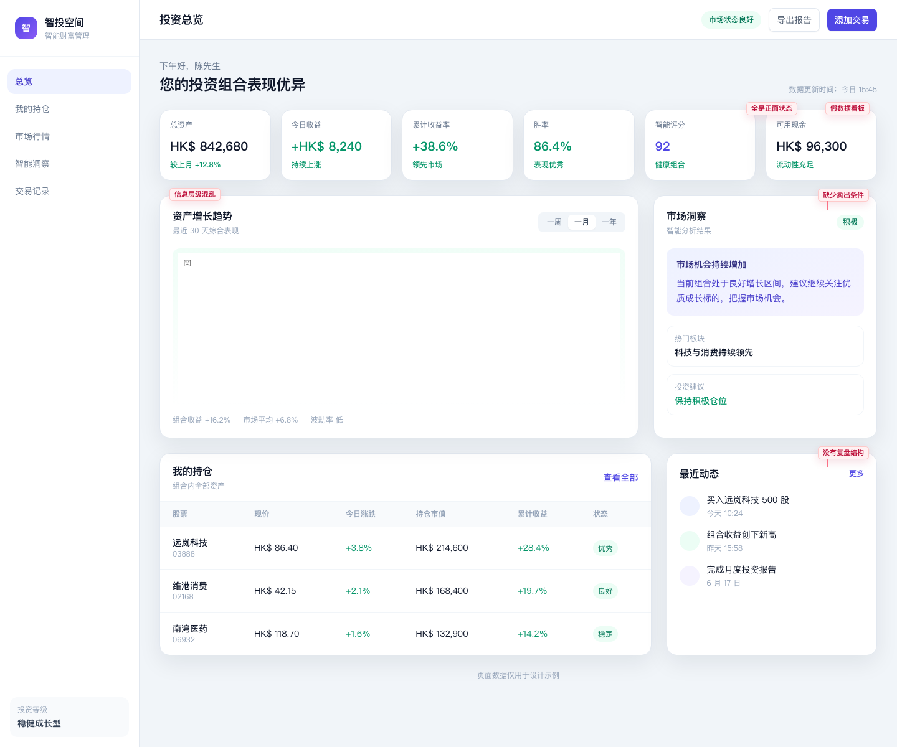
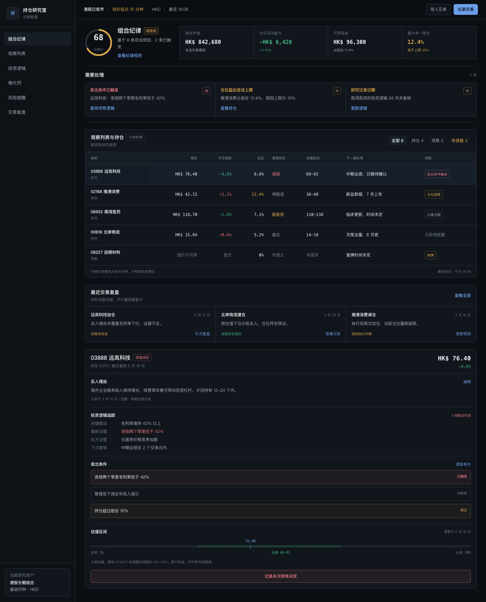

# 别再生成假的 SaaS 界面了。

## 让 AI 写出来的中文软件界面，终于有产品感。

**Aesthetic Skill CN** 是一个让 Cursor / Claude Code / Codex 懂中文软件审美的设计 Skill。

它不是提示词合集，也不是 UI 组件库。它是一套给编程智能体读取和执行的设计判断系统：先识别产品类型与交付模式，再选择风格预设，应用中文平台规则、信息层级、真实业务细节和自然中文文案，最后用统一评分卡自检。

> Stop generating fake SaaS UI. Start building real Chinese product interfaces.

[English README](README.md) · [开始使用](#如何使用) · [查看风格预设](#内置风格预设) · [阅读 SKILL.md](SKILL.md)

## 目录

- [Before / After 展示](#before--after-展示)
- [它解决什么问题](#它解决什么问题)
- [为什么 AI 生成的中文 UI 总有一股“假”味](#为什么-ai-生成的中文-ui-总有一股假味)
- [它如何工作](#它如何工作)
- [内置风格预设](#内置风格预设)
- [交付模式](#交付模式)
- [如何使用](#如何使用)
- [在 Cursor 中使用](#在-cursor-中使用)
- [在 Claude Code / Codex 中使用](#在-claude-code--codex-中使用)
- [仓库结构](#仓库结构)
- [示例提示词](#示例提示词)
- [伦理与使用边界](#伦理与使用边界)
- [路线图](#路线图)

---

## Before / After 展示

同一个业务场景、同一内容规模、同一桌面视口。这里比较的不是“换了什么颜色”，而是 AI 是否真正理解产品任务、信息结构和中文语境。

### 港股投资 Dashboard

v0.1 的核心示例。它需要让用户第一眼看出这是投资研究与交易复盘工具，而不是普通数据 Dashboard。

<table>
  <tr>
    <th width="50%">Before</th>
    <th width="50%">After</th>
  </tr>
  <tr>
    <td></td>
    <td></td>
  </tr>
  <tr>
    <td><strong>问题：</strong>一墙 KPI、随机向上图表和全绿色状态制造“表现很好”的假象；没有买入理由、卖出条件、风险提醒、投资逻辑追踪或交易复盘。</td>
    <td><strong>改进：</strong>先呈现组合纪律与异常，再把持仓连接到买入理由、卖出条件、估值区间、风险提醒和 Thesis Tracker；负收益、停牌、逻辑减弱与数据缺失成为正式状态。</td>
  </tr>
</table>

[查看完整设计说明](examples/before-after/hongkong-stock-dashboard/notes.md)

### AI SaaS Landing Page

<table>
  <tr>
    <th width="50%">Before</th>
    <th width="50%">After</th>
  </tr>
  <tr>
    <td></td>
    <td></td>
  </tr>
  <tr>
    <td><strong>问题：</strong>“重新定义生产力”和“效率提升”没有业务对象、证据或工作流，页面可以替换成任何 AI 产品名称。</td>
    <td><strong>改进：</strong>围绕真实合同审阅任务展示条款差异、引用依据、待确认项和“提交复核”，让 AI 输出处于可检查、可负责的工作流中。</td>
  </tr>
</table>

[查看完整设计说明](examples/before-after/ai-saas-landing/notes.md)

### 小红书内容日历

<table>
  <tr>
    <th width="50%">Before</th>
    <th width="50%">After</th>
  </tr>
  <tr>
    <td></td>
    <td></td>
  </tr>
  <tr>
    <td><strong>问题：</strong>“一键爆款”承诺无法验证，也没有创作者真正需要的排期、封面、负责人和复核状态。</td>
    <td><strong>改进：</strong>把内容日历变成可操作的创作者工作台，明确标题、封面、负责人、发布时间、审核状态和移动端预览。</td>
  </tr>
</table>

[查看完整设计说明](examples/before-after/xiaohongshu-content-calendar/notes.md)

截图脚本同时生成 `390 × 844` 的移动端版本，用于响应式 QA；主 README 暂时只展示桌面截图，避免画廊过重。

---

## 它解决什么问题

AI 很会生成“看起来像软件”的页面，但不一定会生成真正能工作的产品界面。

常见结果是：一个大标题，几句翻译腔口号，蓝紫渐变背景，三到六张功能卡片，几组没有定义的指标，再加一个“立即体验”按钮。把产品名称换掉，页面仍然成立。

这不是产品设计，只是 SaaS 模板语法的重复。

Aesthetic Skill CN 处理的是另一组问题：

- 这个页面服务谁，用户要完成什么任务？
- 主要业务对象是合同、选题、持仓、预约单，还是审批记录？
- 哪些信息必须先看，哪些操作必须后做？
- 港股看盘、小红书内容排期和企业审批，为什么不能共用同一套“卡片仪表盘”？
- `解锁团队潜能` 为什么不如 `提交法务复核`？
- 数据是实时、延迟、估算、缺失，还是示例？
- 页面在加载、失败、无权限、内容为空时还能不能工作？

这个项目重点解决五件事：

1. **中文产品 UI**：不是把英文界面翻译成中文。
2. **平台差异**：Web SaaS、创作者工具、金融看板、微信 H5 和企业工具有不同的工作方式。
3. **信息层级**：先决定用户看什么、做什么，再谈颜色和圆角。
4. **真实业务细节**：使用角色、状态、单位、时间、权限、失败和例外，而不是装饰性指标。
5. **自然中文文案**：按钮描述结果，错误说明原因，页面不再说“赋能、解锁、开启旅程”。

适合：

- 外包工作室与独立开发者
- 小红书 / 抖音 / 私域工具团队
- 金融、投资研究与数据看板开发者
- 使用 Cursor、Claude Code、Codex 构建中文产品的团队

---

## 为什么 AI 生成的中文 UI 总有一股“假”味

### 1. 它先选视觉套路，再猜产品内容

AI 经常从“现代 SaaS”开始，于是自动得到渐变、玻璃卡片、圆角指标和空洞 Hero。真正的设计顺序应该是：用户 → 任务 → 业务对象 → 状态 → 结构 → 视觉。

### 2. 它生成的是功能概念，不是工作界面

`智能分析`、`高效协作`、`安全可靠` 描述的是抽象能力。真实工作界面应该出现 `待复核合同 4 份`、`封面待主编确认`、`卖出条件已触发`。

### 3. 它把英文 SaaS 文案逐句搬进中文

`释放无限潜能`、`开启增长之旅`、`无缝管理工作流` 并不帮助用户做决定。

更好的写法是：

- `新建选题`
- `提交法务复核`
- `导入 6 月账单`
- `确认排期到周五 19:30`
- `文件超过 20 MB，请压缩后重新上传`

### 4. 它用卡片隐藏信息关系

当标题、指标、图表、筛选器、正文和按钮全部被包进相同卡片，层级就消失了。成熟产品更常使用页头、工具栏、表格、主从结构、时间线、编辑器与检查器。

### 5. 它不会主动生成负面状态

真实产品有亏损、停牌、驳回、逾期、失败、无权限、数据缺失和部分完成。只展示成功状态的 UI 更像演示稿，不像软件。

### 6. 它忽略中国平台的操作语境

港股研究需要币种、交易时段和报价延迟；创作者工具需要封面、标题字数、发布时间和移动端预览；微信 H5 需要权限说明、安全区和明确返回路径。这些差异不能靠换主题色解决。

---

## 它如何工作

`SKILL.md` 是入口，也是智能体的执行路由。每次设计任务遵循八步流程：

```text
识别交付模式
    ↓
识别产品类型、用户、任务与业务对象
    ↓
选择一个风格预设
    ↓
读取对应 DESIGN.md
    ↓
应用中文平台规则与中文文案规则
    ↓
执行 Anti-AI-Slop 删除检查
    ↓
生成设计、评审、对照或完整页面
    ↓
使用 SCORECARD.md 自检并修正
```

它不是一个“万能 Prompt”。规则通过渐进式读取组织：智能体先读取核心工作流，再按产品类型加载相关平台规则、风格预设和交付要求，不需要把整套仓库一次塞进上下文。

核心文件：

- [`SKILL.md`](SKILL.md)：智能体工作流与质量门槛
- [`AESTHETIC_STANDARD.md`](AESTHETIC_STANDARD.md)：什么是有产品感的中文 UI
- [`ANTI_AI_SLOP.md`](ANTI_AI_SLOP.md)：Bad / Better / Why 反模式检查
- [`PLATFORM_RULES_CN.md`](PLATFORM_RULES_CN.md)：中文平台与业务环境差异
- [`COPYWRITING_RULES_CN.md`](COPYWRITING_RULES_CN.md)：自然、具体、可执行的中文产品文案
- [`SCORECARD.md`](SCORECARD.md)：六维度、30 分制交付评分

---

## 内置风格预设

### `premium-ai-saas`

深色优先的 AI 工作站。强调真实输入 / 输出面板、引用来源、运行状态、部分失败和人工复核。适合合同审阅、研究整理、质检、知识工作和内部 AI 工具。

不使用机器人吉祥物、大面积蓝紫渐变、虚假准确率或一墙通用功能卡。

[读取 DESIGN.md](design-md/premium-ai-saas/DESIGN.md) · [预览说明](design-md/premium-ai-saas/preview.md)

### `finance-terminal`

面向港股投资者优先、兼容美股、A 股和加密资产研究的信息系统。零售用户可理解，数据语义达到专业研究要求。

包含观察列表、投资逻辑、持仓纪律、买入理由、卖出条件、估值区间、催化剂、风险提醒和交易复盘。亏损、逻辑失效、停牌、数据延迟和导入失败不是边角状态，而是必备状态。

[读取 DESIGN.md](design-md/finance-terminal/DESIGN.md) · [预览说明](design-md/finance-terminal/preview.md)

### `xiaohongshu-creator-tool`

温暖、编辑感、专业的创作者工作站。围绕内容日历、选题库、笔记状态、封面 / 标题方案比较、高表现内容复盘、品牌合作 CRM 和发布节奏组织。

使用克制的柔和红色，不做幼稚粉色 UI，不模仿真实平台视觉，不承诺“爆款率”。

[读取 DESIGN.md](design-md/xiaohongshu-creator-tool/DESIGN.md) · [预览说明](design-md/xiaohongshu-creator-tool/preview.md)

### `local-business-clean`

面向门店、维修、诊所、工作室和预约服务。优先展示服务范围、价格依据、可预约时间、地址、营业时间和退款规则，而不是创业公司式口号。

[读取 DESIGN.md](design-md/local-business-clean/DESIGN.md)

### `dark-devtool`

面向 API、日志、部署和调试场景。高密度、键盘友好、状态清晰；强调环境、耗时、错误原因和恢复动作，不做霓虹赛博朋克装饰。

[读取 DESIGN.md](design-md/dark-devtool/DESIGN.md)

---

## 交付模式

同一套规则支持四种输出，不把所有需求都粗暴地变成“重新设计一个页面”。

| 模式 | 适用请求 | 必要结果 |
|---|---|---|
| **DESIGN.md Mode** | “为这个产品写设计规范” | 产品专属的信息架构、视觉规则、组件、状态、文案与验收标准 |
| **UI Review Mode** | “评审这个页面” | Finding、Evidence、Impact、Correction、Priority 与评分 |
| **Before / After Mode** | “展示改造前后” | 保持业务场景不变，解释结构、文案和平台适配如何改变 |
| **Full Page Mode** | “实现完整页面” | 可运行或可实现的页面、响应式行为、交互状态与自检 |

详细定义见 [`DELIVERABLE_MODES.md`](DELIVERABLE_MODES.md)。

---

## 如何使用

最简单的方法：让编程智能体读取仓库中的 [`SKILL.md`](SKILL.md)，然后提供真实产品上下文。

至少告诉它：

- 产品是什么，不要只说“做一个 SaaS”
- 主要用户是谁
- 用户最常完成的任务是什么
- 业务对象是什么
- 运行在 Web、移动网页还是其他环境
- 需要设计规范、评审、Before / After，还是完整页面

**信息不足：**

```text
帮我做一个高级的 AI SaaS 页面。
```

**信息可执行：**

```text
使用 aesthetic-skill-cn，为一个 5 人采购团队设计中文合同审阅工作台。
主要任务是比较供应商合同版本并提交法务复核。
交付完整桌面页面，同时定义 1024px 和 375px 下的行为。
```

---

## 在 Cursor 中使用

### 方法一：仓库随项目读取

1. 将 `aesthetic-skill-cn` 放入当前工作区，或作为独立目录供 Cursor 读取。
2. 在项目规则中要求设计任务先读取 `aesthetic-skill-cn/SKILL.md`。
3. 在请求中写明产品上下文和交付模式。

示例：

```text
先读取 aesthetic-skill-cn/SKILL.md。
使用 finance-terminal 评审当前持仓页，然后修复所有 P0 / P1 问题。
必须检查币种、报价时间、亏损状态、卖出条件和移动端表格行为。
```

### 方法二：复制为团队设计规则

将 `SKILL.md` 与相关规则文件保存在团队统一可访问的位置。不要只复制某个 `prompt.md`；`prompt.md` 是调用模板，真正的判断在核心规则和对应 `DESIGN.md` 中。

Cursor 的具体规则路径可能随版本和团队配置变化；以你当前使用的 Cursor 配置方式为准。关键不是文件放在哪，而是智能体能读取相对引用并按顺序执行。

---

## 在 Claude Code / Codex 中使用

1. 将仓库克隆或复制到智能体可读取的位置。
2. 在任务中明确指定 `aesthetic-skill-cn/SKILL.md`，或将整个目录安装到相应的 skills 目录。
3. 要求智能体按 `SKILL.md` 选择模式、平台和预设，不要直接跳到写组件。

Claude Code 示例：

```text
Read aesthetic-skill-cn/SKILL.md and use xiaohongshu-creator-tool.
为三人内容工作室实现一周排期页面，包含封面、标题、负责人、复核状态、发布时间和移动端预览。
不要伪造平台发布能力或互动数据。
```

Codex 示例：

```text
Use $aesthetic-skill-cn in Full Page Mode.
把现有 AI 合同审阅页改造成 premium-ai-saas 工作站。
保留现有功能，补齐来源、部分失败、无权限和人工复核状态，并用 SCORECARD.md 自检。
```

不同工具对 Skill 的安装与调用方式可能不同，但工作原则相同：**让智能体读取规则文件，而不是只向它粘贴一句“做得高级一点”。**

---

## 仓库结构

```text
aesthetic-skill-cn/
├── SKILL.md                    # 智能体入口与执行工作流
├── AESTHETIC_STANDARD.md       # 中文产品 UI 质量标准
├── ANTI_AI_SLOP.md             # AI 模板化反模式
├── STYLE_PRESETS.md            # 风格选择规则
├── DELIVERABLE_MODES.md        # 四种交付模式
├── COPYWRITING_RULES_CN.md     # 中文产品文案规则
├── PLATFORM_RULES_CN.md        # 中文平台适配规则
├── SCORECARD.md                # 30 分制自检与评审
├── design-md/
│   ├── premium-ai-saas/
│   ├── finance-terminal/
│   ├── xiaohongshu-creator-tool/
│   ├── local-business-clean/
│   └── dark-devtool/
├── examples/
│   ├── before-after/           # 结构改造示例
│   └── ui-reviews/             # 评审示例
├── docs/                       # 安装、工具使用与贡献说明
└── scripts/                    # 预览、导出与截图辅助脚本
```

---

## 示例提示词

### 1. 评审一个通用 SaaS 页面

```text
使用 aesthetic-skill-cn 的 UI Review Mode 评审这个中文后台。
重点检查信息层级、业务真实性、翻译腔文案、卡片数量和平台适配。
每个问题给出证据、影响、修改方案和优先级，最后使用 SCORECARD.md 评分。
```

### 2. 创建 AI 工作站

```text
使用 premium-ai-saas 为中文客服质检团队设计深色 AI 工作站。
展示通话输入、质检结果、引用片段、低置信度项、复核人和申诉状态。
不要使用聊天首页、机器人、大渐变或虚假准确率。
```

### 3. 创建港股研究看板

```text
使用 finance-terminal 创建港股研究与持仓纪律页面。
包含观察列表、投资逻辑、买入理由、卖出条件、估值区间、催化剂、风险提醒和交易复盘。
显示 HKD、报价延迟、亏损、停牌、逻辑失效和数据缺失状态。
```

### 4. 创建内容排期工具

```text
使用 xiaohongshu-creator-tool 为家居内容工作室设计周排期。
包含选题库、封面与标题方案比较、负责人、复核状态、品牌合作交付、回款状态和移动端预览。
不要承诺爆款，不要伪造 A/B 测试或一键发布能力。
```

### 5. 生成产品专属 DESIGN.md

```text
使用 aesthetic-skill-cn 的 DESIGN.md Mode。
为一个中文企业报销与审批工具编写完整 DESIGN.md。
参考 Feishu / enterprise 平台规则，但不要复制任何真实产品的品牌或界面。
规范必须包含信息架构、视觉令牌、组件、权限、批量失败、中文文案和响应式行为。
```

---

## 伦理与使用边界

Aesthetic Skill CN 的目标是提高设计判断，不是提高模仿效率。

### 不鼓励，也不支持

- 复制真实品牌 Logo、图标、插画或视觉资产
- 照搬真实产品截图、专有布局、组件细节或完整视觉身份
- 伪造客户 Logo、用户数量、评价、收入、收益率或案例
- 隐藏金融数据延迟、费用、风险、估算或缺失状态
- 通过虚假稀缺、默认勾选、隐蔽授权或难以取消的流程操纵用户
- 暗示不存在的平台集成、发布能力、AI 准确率或保证结果

### 可以做

- 研究一种产品类别需要哪些信息和操作
- 使用通用布局模式，如列表—详情、编辑器—检查器、日历—预览
- 建立原创的颜色、排版、组件与交互系统
- 用中性或明确标记的示例数据验证界面
- 在不复制视觉身份的前提下适配平台工作流与用户习惯

当参考真实产品时，提取的是**问题、约束和交互原则**，不是品牌外观。

完整边界见 [`docs/ethics.md`](docs/ethics.md)。

---

## 路线图

### v0.1 — 核心判断系统

- [x] AI 可读的 `SKILL.md` 工作流
- [x] 中文产品审美标准与 Anti-AI-Slop 规则
- [x] 中文文案、平台差异、交付模式与评分卡
- [x] `premium-ai-saas` 完整预设
- [x] `finance-terminal` 完整预设
- [x] `xiaohongshu-creator-tool` 完整预设
- [x] Before / After 与 UI Review 基础示例

### v0.2 — 示例与验证

- [ ] 补充三组高质量 Before / After 截图
- [ ] 增加真实视口下的响应式示例
- [ ] 建立预设输出的自动截图与视觉回归流程
- [ ] 扩展 UI Review 示例与常见失败库
- [ ] 增加面向外包交付的验收清单

### v0.3 — 平台与场景扩展

- [ ] 完善 `local-business-clean`
- [ ] 完善 `dark-devtool`
- [ ] 增加微信 H5 / 私域运营预设
- [ ] 增加飞书式企业协作与审批预设
- [ ] 增加移动端中文工具与数据密集型后台指南

路线图不以“更多风格”为唯一目标。优先级始终是：更准确的产品判断、更可信的中文细节、更可验证的输出。

---

## 最后

中文产品界面的问题，从来不只是字体、颜色或圆角。

真正的差距在于：AI 是否理解业务对象，是否建立清晰层级，是否尊重平台差异，是否写出自然中文，是否愿意诚实地展示失败、限制和风险。

**别再生成假的 SaaS 界面了。**

**让 AI 写出来的中文软件界面，终于有产品感。**
